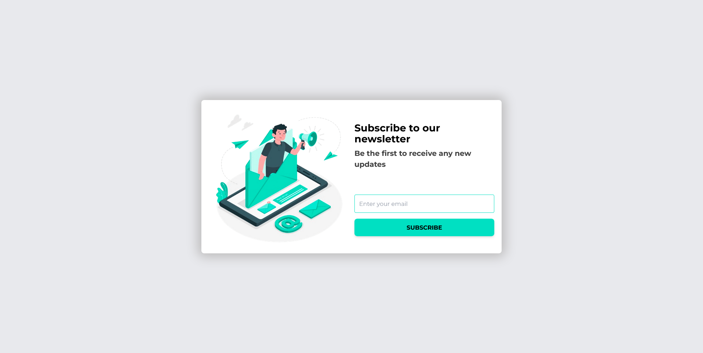

# WebDevDaily - Subscribe Popup 

This is a solution to [Subscribe Popup](https://www.webdevdaily.io/challenges/subscribe-popup-284) on [Webdevdaily.io](https://www.webdevdaily.io/) website.

## Objective

Convert this design to code, attempting to get it as close as possible using HTML, CSS and JavaScript.

## Design

## Screenshot

## Useful Resources
- [Reverse Image Search](https://www.duplichecker.com/reverse-image-search.php) - I used this tool to find the exact image from the design.
- [Remove background](https://www.remove.bg/) - Removes background on images
- [Tinypng](https://tinypng.com/) - Optimize your images
- [Google-webfonts-helper](https://gwfh.mranftl.com/fonts) - A free way to self-host Google Fonts

## Demo

- GitHub Pages: [GitHub Pages](https://bccpadge.github.io/subscribe-popup/)

## Built with  React + Vite

This template provides a minimal setup to get React working in Vite with HMR and some ESLint rules.

Currently, two official plugins are available:

- [@vitejs/plugin-react](https://github.com/vitejs/vite-plugin-react/blob/main/packages/plugin-react/README.md) uses [Babel](https://babeljs.io/) for Fast Refresh
- [@vitejs/plugin-react-swc](https://github.com/vitejs/vite-plugin-react-swc) uses [SWC](https://swc.rs/) for Fast Refresh
